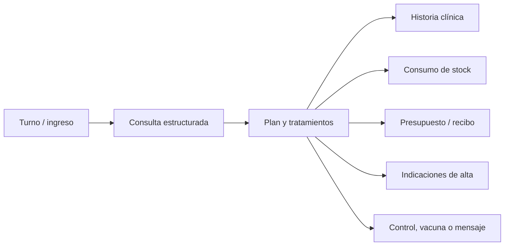

# Relevamiento funcional y UX de VetCare

Fecha: 28 de julio de 2026
Objetivo: identificar mejoras de alto impacto a partir del manual de Vetter 5.0, el uso real de VetCare, su implementación actual y alternativas modernas del mercado.

## 1. Resumen ejecutivo

VetCare ya tiene una base valiosa: identidad visual clara, navegación consistente, agenda, pacientes, tutores, ficha clínica, vacunas, estudios, avisos, inventario por lotes, recibos, respaldo local y sincronización con D1. La aplicación se entiende rápido y la pantalla "Hoy" funciona bien como punto de entrada, especialmente en móvil.

El principal problema no es la cantidad de módulos. Es que los módulos todavía funcionan como islas. Una consulta clínica, un producto utilizado, un recibo, un movimiento de stock y un recordatorio son registros separados que el usuario debe relacionar manualmente. Las alternativas más maduras convierten la atención clínica en el centro del sistema y hacen que una sola acción actualice todo lo demás.

La oportunidad de mayor impacto es transformar este recorrido:

Antes de ampliar funciones hay cuatro problemas de confiabilidad que deben corregirse:

1. Las fechas precargadas usan UTC y pueden quedar un día adelantadas en Argentina.
2. La interfaz captura signos vitales, examen y diagnóstico, pero el esquema del backend no los guarda; al volver a cargar se pueden perder.
3. Los totales "cobrados" incluyen recibos pendientes o cancelados.
4. Cada guardado vuelve a enviar secuencialmente todas las entidades y el backend reemplaza todos los hijos de una mascota; esto escala mal y facilita conflictos entre usuarios.

La recomendación general es:

- primero asegurar fechas, persistencia, permisos, sincronización y cálculos;
- luego crear el flujo integral de consulta;
- después automatizar comunicaciones, cobros e inventario;
- recién entonces sumar portal del tutor, internación, laboratorio avanzado o IA.

## 2. Alcance y método

Se revisaron:

- las 23 páginas de [`manual_vetter5.pdf`](../_otros/manual_vetter5.pdf);
- el frontend completo de VetCare;
- el Worker, las migraciones D1 y las pruebas existentes;
- la aplicación en funcionamiento en desktop y en un viewport móvil de 390 x 844;
- el flujo de pacientes, ficha clínica, estudios, agenda, calendario, inventario, configuración y recibos;
- alternativas internacionales y argentinas vigentes al 28/07/2026.

Validaciones ejecutadas:

- `npm run build`: correcto;
- `npm test`: 3 pruebas aprobadas;
- `npm run check`: sintaxis de 21 archivos JavaScript, TypeScript, tipos de Wrangler y bundle del Worker correctos;
- Worker dry-run: 21,51 KiB sin comprimir y 5,69 KiB gzip.

No se obtuvieron métricas numéricas de Core Web Vitals porque el entorno no tiene conectado Chrome DevTools MCP. Las conclusiones de rendimiento web se basan en el código, los recursos publicados y el comportamiento observado; no se presentan cifras inventadas de LCP, CLS o INP.

## 3. Qué hace bien VetCare hoy

### Producto y experiencia

- La arquitectura de información por áreas es fácil de aprender.
- "Hoy" prioriza turnos, peluquería y avisos, evitando abrir primero un panel abstracto.
- La búsqueda global alcanza pacientes, tutores, turnos y texto del historial.
- La ficha admite varios tutores por paciente.
- El alta de una consulta ya contempla motivo, profesional, peso, temperatura, frecuencia cardíaca, examen, diagnóstico, tratamiento y próximo control.
- La próxima dosis de una vacuna y el próximo control pueden generar avisos.
- La vista calendario ofrece mes, semana y día.
- La experiencia móvil general es legible y las acciones principales tienen buen tamaño táctil.
- La cámara, la compresión de imágenes y las siluetas por especie son detalles prácticos para una clínica pequeña.
- La carga de stock por lotes y vencimiento es una buena base.
- Los recibos se pueden imprimir con datos de la clínica.
- IndexedDB, exportación de respaldo y D1 ofrecen más resiliencia que una app puramente local.

### Base técnica

- Frontend sin framework y relativamente pequeño.
- Worker tipado y migraciones versionadas.
- CORS restringido y sesiones con vencimiento.
- Contraseñas derivadas con PBKDF2 y sal.
- Integración local/servidor encapsulada en `api.js`.
- La separación reciente de módulos facilita evolucionar la aplicación sin reescribirla.

Estas fortalezas justifican evolucionar VetCare sobre la base actual. No hace falta reemplazar toda la interfaz para lograr un salto importante.

## 4. Hallazgos críticos de confiabilidad

### P0. Fechas incorrectas por zona horaria

VetCare usa `new Date().toISOString().split('T')[0]` para crear fechas de negocio. `toISOString()` convierte primero a UTC. En Argentina, durante la tarde/noche local, el resultado puede pertenecer al día siguiente.

La auditoría visual mostró la contradicción:

- la cabecera de "Hoy" indicaba 28 de julio;
- un recibo nuevo precargaba 29 de julio;
- los datos de demostración calculados como "mañana" terminaron el 30 de julio.

El patrón aparece en dashboard, pantalla Hoy, recibos, consultas, vacunas, cumpleaños, respaldos y datos demo. Ejemplos: `js/dashboard.js:2`, `js/app-shell.js:101`, `js/invoices.js:47`, `js/pets.js:551` y `js/pets.js:688`.

Impacto:

- turnos o recibos en el día equivocado;
- avisos adelantados o atrasados;
- estadísticas diarias incorrectas;
- pérdida de confianza del usuario.

Acción:

- crear una única utilidad `localDateKey(date)` que use año, mes y día locales;
- representar fechas sin hora como `YYYY-MM-DD` y no convertirlas a UTC;
- reservar ISO UTC para instantes reales como `created_at`;
- agregar pruebas con `America/Argentina/Buenos_Aires`, incluyendo horas cercanas a medianoche UTC.

### P0. La consulta captura datos que el backend descarta

El formulario clínico guarda `weight`, `temp`, `hr`, `exam`, `diagnosis` y `nextControl` (`js/pets.js:615-618`) y también construye `pet.vitals` (`js/pets.js:627-631`).

Sin embargo:

- `pet_history` sólo tiene fecha, tipo, título, descripción, tratamiento y veterinario (`backend/migrations/0001_initial.sql:101-110`);
- el Worker sólo inserta esos campos (`backend/worker.ts:313`);
- `pets` no tiene un campo para `vitals`;
- la tarjeta del historial tampoco muestra examen, diagnóstico o signos vitales;
- no hay acción visible para editar o imprimir un registro ya creado, aunque existen funciones parciales para ello.

Un usuario puede completar una consulta detallada, verla brevemente y perder parte de la información después de sincronizar o recargar.

Acción:

- migrar los campos clínicos a un modelo persistente explícito;
- crear `encounters` y `encounter_vitals`, o ampliar `pet_history` de forma completa;
- agregar pruebas de ida y vuelta: crear consulta → guardar API → recargar → comparar todos los campos;
- mostrar examen, diagnóstico, signos y control en la ficha;
- exponer acciones de editar, imprimir y emitir indicaciones.

### P0. Sincronización completa, costosa y propensa a conflictos

Cada `saveDB()` recorre todas las colecciones y hace un `POST` secuencial por cada registro (`js/api.js:117-120`), aunque sólo haya cambiado uno. Para una clínica objetivo de 300-400 clientes, una modificación menor puede producir cientos de solicitudes.

Además, guardar una mascota elimina y vuelve a insertar todo su historial, vacunas, imágenes, estudios y tutores (`backend/worker.ts:383-389`). Dos usuarios trabajando sobre la misma ficha pueden sobrescribirse sin advertencia.

Consecuencias:

- latencia creciente a medida que crece la clínica;
- mensajes de error después de que la UI ya pareció guardar;
- consumo innecesario de Worker y D1;
- riesgo de "último guardado gana";
- reenvío repetido de imágenes Base64 y del historial completo.

Acción:

- enviar sólo la entidad modificada;
- incorporar endpoint batch para operaciones relacionadas;
- usar `updated_at` y `version` para control optimista de concurrencia;
- guardar hijos por CRUD propio en vez de reemplazar toda la colección;
- paginar listados e historial;
- mover imágenes a R2 y cargar miniaturas bajo demanda;
- mostrar estados reales: guardando, guardado, sin conexión, conflicto, error con reintento.

### P0. Indicadores financieros incorrectos

`renderInvoices()` suma todos los recibos para "Total cobrado" (`js/invoices.js:3`) y el dashboard hace lo mismo (`js/dashboard.js:6`). Pendientes y cancelados inflan el ingreso.

También:

- la numeración es `cantidad actual + 1`, por lo que borrar o crear en simultáneo puede repetir números;
- no hay pagos parciales;
- no hay método de pago;
- no hay fecha de vencimiento ni cuenta corriente;
- el tutor y el paciente se eligen de listas independientes y pueden no corresponderse;
- una línea de recibo no descuenta inventario;
- "recibo" no equivale a factura fiscal.

Acción inmediata:

- calcular cobrado sólo con estado `paid`;
- excluir cancelados de ventas y deuda;
- validar la relación tutor-paciente;
- numerar en servidor con secuencia por clínica;
- separar documento, saldo y pagos.

### P0/P1. Autenticación sin permisos ni alcance de clínica

El Worker autentica al usuario, pero todas las consultas hacen `SELECT *` sin filtrar por usuario o clínica (`backend/worker.ts:242-244`). El campo `role` se devuelve, pero no autoriza ninguna acción.

Esto puede ser deliberado para una única clínica con 2-3 administradores, pero implica:

- todos los usuarios ven y modifican todo;
- cualquiera puede borrar fichas, recibos o stock;
- no hay trazabilidad del autor;
- el despliegue no puede alojar varias clínicas de forma segura.

Acción:

- agregar `clinics`, `clinic_members` y `clinic_id` a las entidades;
- definir permisos mínimos: administrador, veterinario, recepción y peluquería;
- registrar `created_by`, `updated_by` y auditoría de acciones clínicas/financieras;
- hacer borrado lógico para historia clínica y documentos sensibles.

## 5. Evaluación funcional de VetCare

| Área | Estado actual | Madurez | Brecha principal |
| --- | --- | --- | --- |
| Tutores y pacientes | Alta, edición, asociaciones múltiples, búsqueda y filtros | Útil | Falta segmentación, fallecido/inactivo, duplicados, documentos y vista longitudinal |
| Ficha clínica | Historia, datos, tutores, estudios, fotos y vacunas | En riesgo | Campos clínicos no persistidos ni visibles de forma completa |
| Vacunas | Nombre, aplicación, próxima dosis y aviso | Básica | Falta producto/lote/serie, profesional, certificado, plan preventivo y estado vencido |
| Estudios | Link de Drive, tipo, fecha, título y galería | Básica | Falta archivo gestionado, estado solicitado/recibido/revisado y laboratorio estructurado |
| Agenda | Lista y calendario mensual/semanal/diario | Básica | Falta duración, estados, confirmación, recursos, solapamientos, repetición y lista de espera |
| Peluquería | Turno, servicio, profesional, precio y estado | Útil pero aislada | No genera cobro, consumo, ficha de servicio ni comunicación |
| Avisos | Pendientes/completados, vínculo a paciente y acceso manual a WhatsApp | Básica | No hay envío automático, cola, plantillas por evento ni historial de contacto |
| Inventario | Catálogo, mínimo, lotes, vencimiento y baja manual | Básica | Falta costo, proveedor, compra, número de lote, movimientos y consumo automático |
| Recibos | Ítems, tutor, paciente, estado, total e impresión | Inicial | Cálculos erróneos, sin pagos parciales, caja, cuenta corriente, fiscalidad ni stock |
| Panel | Conteos, últimos siete días, especies y alertas | Inicial | No representa flujo clínico ni rentabilidad; usa importes incorrectos |
| Respaldo | D1, IndexedDB y exportación/importación | Buena base | La sincronización completa y Base64 limitan escala y resolución de conflictos |
| Multiusuario | Login y sesiones | Inicial | Sin permisos, auditoría, alcance de clínica ni autoría |
| Móvil | Navegación y pantallas principales adaptadas | Buena base | Ficha modal, pestañas con scroll incómodo y tablas con información oculta |
| Accesibilidad | Roles principales y foco visible en parte de la UI | Incompleta | Tabs genéricos, labels no asociados, botones "×" sin nombre y controles sólo visuales |

## 6. Qué aporta el manual de Vetter 5.0

El manual es de 2011 y no debe copiarse literalmente. Su valor está en cómo modela el trabajo de la clínica.

### Ideas que VetCare debería recuperar

#### La ficha integral

Vetter define la ficha como la parte más importante del sistema y reúne cliente, pacientes, vacunas, historia, métodos complementarios, cuenta corriente, fotos y controles (páginas 6-10).

VetCare ya se acerca a esa idea, pero la ficha es un modal. Debería convertirse en una pantalla con URL propia y contexto persistente.

#### Seguimiento preventivo como fuente de salud e ingresos

Vetter separa revacunaciones, desparasitaciones y controles, permite consultar períodos y evita avisos duplicados (páginas 10-11).

Interpretación moderna:

- cola preventiva por paciente;
- estado próxima, vencida, contactada, agendada y completada;
- reglas según especie, edad y servicio;
- mensajes automáticos con registro del resultado.

#### Laboratorio estructurado

Vetter guarda análisis de orina, hemograma y bioquímica, compara valores con referencias por especie y permite imprimirlos (páginas 8-9 y 20-22).

VetCare sólo guarda un link. Una evolución útil sería:

- orden de estudio;
- resultados estructurados;
- adjunto original;
- rango de referencia configurable;
- indicador alto/bajo;
- revisión por profesional;
- tendencia longitudinal.

No conviene implementar todos los analitos antes de validar el uso. Primero se puede crear un modelo flexible de panel + resultado + unidad + rango.

#### Operación administrativa completa

Vetter integra:

- compras y proveedores;
- stock mínimo;
- ventas y cuenta corriente;
- caja diaria y cierres;
- ingresos, egresos y ganancia;
- estadísticas por mes;
- certificados y plantillas.

VetCare tiene los comienzos de stock y recibos, pero no la cadena de trazabilidad.

### Funciones concretas del manual todavía ausentes o incompletas

| Función de Vetter | Situación en VetCare | Recomendación |
| --- | --- | --- |
| Búsqueda y filtros combinables de clientes/pacientes | Parcial | Guardar filtros, segmentar y permitir acciones masivas |
| Estado fallecido | Ausente | Incorporar estado clínico sin borrar historial |
| Serie/lote de vacuna y certificado | Ausente | Vincular vacuna aplicada con lote de inventario y PDF |
| Controles clínicos futuros | Parcial | Convertir avisos en tareas con estado, responsable y resultado |
| Laboratorio con rangos | Ausente | Crear resultados estructurados por etapas |
| Cuenta corriente | Ausente | Libro mayor del tutor, pagos parciales y saldo |
| Peluquería vinculada a caja | Ausente | Cerrar servicio y generar cobro automáticamente |
| Cálculo de ración | Ausente | Sólo sumar si la clínica lo usa; puede ser una calculadora pequeña |
| Compras y proveedores | Ausente | Prioridad alta para completar inventario |
| Caja diaria y arqueo | Ausente | Prioridad alta para una clínica argentina |
| Estadísticas mensuales | Parcial | Reemplazar por tablero operativo y financiero confiable |
| Cartas y certificados | Parcial/ausente | Modernizar a PDF, email y WhatsApp |
| Backup/restauración | Presente | Mantener y agregar versionado/estado de sincronización |

### Qué no conviene copiar

- cartas impresas como canal principal;
- ventanas separadas para cada tarea;
- borrados irreversibles;
- fotos BMP y vínculos a archivos locales;
- actualización manual de índices;
- dependencia de backup manual semanal;
- códigos crípticos o campos sin autocompletado.

## 7. Comparación con alternativas actuales

Las páginas de producto son afirmaciones de sus propios proveedores; sirven para detectar expectativas del mercado, no como validación independiente de resultados comerciales.

### Patrones globales

[ezyVet](https://www.ezyvet.com/features) conecta ficha clínica, plantillas, estándares preventivos, recordatorios, portal del cliente, mensajes, inventario, pagos y reportes. Su diferencia no es sólo tener esos módulos, sino usar reglas para determinar cuidados pendientes y automatizar comunicaciones.

[Shepherd](https://www.shepherd.vet/features/) convierte el SOAP en el centro: completar la consulta puede actualizar la historia, la factura, las indicaciones, el inventario y los recordatorios. También destaca presupuestos, firma, captura automática de cargos, panel de pacientes dentro de la clínica y tareas.

[Digitail](https://digitail.com/) extiende ese modelo con seguimiento de signos vitales, planes de tratamiento, colaboración, internación, anestesia, odontograma, flowboard, laboratorio, recetas, formularios y firma electrónica, portal/app del tutor y automatizaciones con IA.

[Covetrus Pulse](https://covetrus.com/covetrus-platform/workflow-and-productivity-tools/covetrus-pulse/) enfatiza historia con comunicaciones y diagnósticos, agenda online, mensajes, pagos integrados, planes de cuidado e inventario conectado a proveedores.

[PetDesk](https://petdesk.com/veterinary-client-engagement-software) y [Vetstoria](https://www.vetstoria.com/) muestran que la experiencia del tutor ya se considera parte central del producto: reserva online, recordatorios, confirmaciones, mensajería bidireccional, formularios previos y depósitos.

### Expectativas visibles en Argentina

[EasyVet Argentina](https://www.easyvet.com.ar/) publica como funciones centrales factura electrónica, control de caja, certificados, WhatsApp, turnera pública, multisucrusal y vademécum SENASA.

[VetCita](https://vetcita.com.ar/) ofrece turnos online, recordatorios por WhatsApp/email, pagos parciales, archivos, PDFs, compras/ventas y facturación.

[Aturna VET](https://www.aturna-vet.com.ar/) destaca agenda por profesional, historia, internaciones, cirugías y stock.

Esto marca una brecha local concreta: para competir en Argentina, "recibos" e "inventario" no alcanzan. Los usuarios esperan WhatsApp, caja, pagos, factura electrónica, certificados y turnos online.

### Diferencia esencial

| Modelo | Cómo trabaja |
| --- | --- |
| VetCare actual | El usuario mantiene agenda, historia, stock, recibo y aviso por separado |
| Vetter 5.0 | Una ficha central conecta varias áreas, pero con mucha operación manual |
| Alternativas modernas | La consulta o el servicio dispara automáticamente cargos, stock, documentos, comunicación y seguimiento |

## 8. Propuesta de diseño de alto impacto

### 8.1. Convertir la ficha en un espacio de trabajo

La ficha no debería vivir en un modal. Propuesta:

- ruta propia: `/pacientes/:id`;
- encabezado fijo con foto, nombre, especie, edad, peso, tutor y contacto;
- alertas siempre visibles: alergias, condición crónica, deuda, vacuna vencida;
- próximo turno, último peso y última consulta;
- acciones: nueva consulta, nuevo turno, cobrar, mensaje, documento;
- historial navegable y filtrable.

Pestañas sugeridas:

1. Resumen.
2. Consultas.
3. Preventivo.
4. Estudios y documentos.
5. Indicaciones y recetas.
6. Comunicaciones.
7. Cuenta.

En móvil, usar un selector compacto o tabs desplazables sin scrollbar visible y con semántica ARIA correcta.

### 8.2. Crear la entidad "consulta/atención"

Una atención debe tener estado:

- borrador;
- en curso;
- pendiente de resultados;
- lista para cobrar;
- cerrada;
- reabierta con motivo.

Contenido mínimo:

- motivo/anamnesis;
- signos vitales con tendencia;
- examen;
- problemas/diagnósticos;
- procedimientos;
- medicamentos y dosis;
- estudios solicitados;
- plan;
- indicaciones;
- próximo control;
- servicios e insumos facturables.

Al cerrar una atención, VetCare debería mostrar una revisión única:

- qué queda en la historia;
- qué se factura;
- qué stock se descuenta;
- qué indicaciones se entregan;
- qué seguimiento se agenda.

### 8.3. Agenda orientada al flujo de pacientes

Agregar:

- duración por tipo de turno;
- profesional y, si aplica, sala/recurso;
- estados solicitado, confirmado, llegó, esperando, en consulta, finalizado, no asistió y cancelado;
- detección de solapamientos;
- color por estado, no sólo por categoría;
- reprogramación;
- recurrencia;
- lista de espera;
- confirmación y depósito opcional;
- acción "Iniciar consulta".

La vista semanal actual agrupa eventos dentro de cajas por día, pero no representa horas ni superposiciones. Para operación diaria conviene una grilla de tiempo por profesional.

### 8.4. Centro de comunicaciones

Los links manuales a WhatsApp son útiles como primera versión, pero no permiten saber qué se envió ni si se confirmó.

Propuesta:

- cola de mensajes por enviar;
- plantillas para turno, vacuna, control, cumpleaños, presupuesto e indicaciones;
- variables de tutor, paciente, fecha, profesional y servicio;
- canales WhatsApp y email;
- estado preparado, enviado, entregado, respondido y error;
- historial visible desde tutor y paciente;
- consentimiento y preferencia de canal;
- reintentos y exclusión de duplicados.

### 8.5. Caja, cuenta corriente y pagos

Separar conceptos:

- presupuesto;
- factura/recibo;
- pago;
- saldo del tutor;
- movimiento de caja;
- cierre/arqueo.

Funciones:

- pagos parciales;
- efectivo, transferencia, tarjeta y Mercado Pago;
- descuentos y recargos;
- vencimiento;
- saldo por tutor;
- apertura/cierre de caja;
- ingresos y egresos;
- anulaciones con motivo;
- documento fiscal mediante integración ARCA cuando el negocio lo requiera;
- trazabilidad del usuario que cobró o anuló.

### 8.6. Inventario transaccional

El inventario necesita un libro de movimientos, no sólo el número actual.

Agregar:

- SKU/código de barras;
- unidad y presentación;
- costo y precio;
- proveedor;
- lote real y vencimiento;
- compra/recepción;
- ajuste con motivo;
- consumo vinculado a consulta o venta;
- devolución;
- política FEFO: usar primero el lote que vence antes;
- sugerencia de reposición;
- margen y valorización.

El alta de producto debe estar disponible directamente desde Inventario. Hoy obliga a descubrir "Opciones → Catálogo", una separación que aumenta fricción.

### 8.7. Laboratorio y documentos

Evolución por etapas:

1. subir archivos a R2 con metadatos y miniatura;
2. solicitud y estado del estudio;
3. resultado estructurado flexible;
4. rangos y tendencias;
5. integraciones con laboratorios.

Documentos de alto valor:

- certificado de vacunación;
- certificado de salud;
- receta/indicaciones;
- consentimiento informado;
- presupuesto;
- alta;
- historia clínica exportable.

### 8.8. Panel operativo, no sólo estadístico

La pantalla principal debería responder:

- ¿quién llegó y quién espera?;
- ¿qué consulta está incompleta?;
- ¿qué estudio llegó y nadie revisó?;
- ¿qué cobro quedó pendiente?;
- ¿qué vacuna o control vence?;
- ¿qué producto está bajo o por vencer?;
- ¿qué mensaje falló?;
- ¿qué caja falta cerrar?

Métricas posteriores:

- inasistencia y cancelación;
- tiempo de espera;
- tiempo de cierre de consulta;
- cumplimiento preventivo;
- pacientes activos/inactivos;
- ingreso cobrado, pendiente y anulado;
- ticket promedio;
- margen por servicio/producto;
- rotación y vencimiento de stock;
- retención y reactivación.

### 8.9. IA: después de asegurar el flujo

Las alternativas modernas promocionan dictado SOAP, resúmenes, indicaciones y captura de cargos. Son oportunidades reales, pero no deben ser la primera prioridad de VetCare.

Orden recomendado:

1. persistencia correcta y datos estructurados;
2. flujo de consulta;
3. permisos y auditoría;
4. plantillas y automatización determinística;
5. dictado y resumen asistido;
6. sugerencias clínicas sólo con fuentes, límites y revisión profesional.

La IA debería proponer borradores, nunca cerrar una consulta, emitir un diagnóstico o cobrar sin confirmación.

## 9. Arquitectura de información propuesta

Menú principal:

- Hoy
- Agenda
- Pacientes
- Comunicaciones
- Caja y ventas
- Stock y compras
- Reportes
- Configuración

Módulos condicionales:

- Peluquería
- Internación
- Cirugía/anestesia
- Laboratorio
- Sucursales

Esto reduce la navegación permanente. Cumpleaños pasa a Comunicaciones/Marketing; recibos pasa a Caja y ventas; respaldo y catálogo pasan a Configuración o Stock según corresponda.

## 10. Priorización

Escala de impacto: 5 = afecta seguridad, integridad, ingresos o trabajo diario; 1 = mejora menor. El esfuerzo es relativo y debe ajustarse con el equipo.

| Orden | Iniciativa | Impacto | Esfuerzo | Razón |
| ---: | --- | :---: | :---: | --- |
| 1 | Corregir fechas locales y pruebas de zona horaria | 5 | 1 | Puede alterar cada operación diaria |
| 2 | Persistir todos los campos clínicos y probar round-trip | 5 | 2 | Riesgo directo de pérdida de historia |
| 3 | Corregir indicadores y modelo de pagos | 5 | 2 | Los números actuales pueden inducir decisiones erróneas |
| 4 | Sincronización incremental, versiones y estados de guardado | 5 | 3 | Base para multiusuario y crecimiento |
| 5 | Permisos, auditoría y alcance de clínica | 5 | 3 | Evita accesos y borrados indiscriminados |
| 6 | Ficha como página + flujo integral de consulta | 5 | 4 | Mayor mejora de productividad y calidad |
| 7 | Estados de agenda, duración, confirmación y check-in | 5 | 3 | Mejora recepción y reduce huecos |
| 8 | Consulta → cobro → stock → seguimiento | 5 | 4 | Reduce doble carga y cargos omitidos |
| 9 | Comunicaciones automáticas con historial | 5 | 3 | Menos llamadas, ausencias y olvidos |
| 10 | Caja, pagos parciales y cuenta corriente | 4 | 4 | Necesario para gestión real |
| 11 | Compras, proveedores y movimientos de stock | 4 | 3 | Completa el circuito de inventario |
| 12 | Archivos R2 y documentos/certificados | 4 | 3 | Mejora clínica, tutor y escala |
| 13 | Panel operativo y reportes confiables | 4 | 3 | Convierte datos en decisiones |
| 14 | Turnos online y formularios/consentimientos | 4 | 4 | Mejora experiencia del tutor |
| 15 | Laboratorio estructurado | 3-5 | 4 | Impacto depende del perfil de la clínica |
| 16 | Internación, cirugía y anestesia | 3-5 | 5 | Sólo si forma parte del servicio real |
| 17 | IA para dictado y resumen | 3 | 4 | Aporta después de estabilizar el núcleo |
| 18 | Calculadora de ración | 1-3 | 1 | Útil sólo si se valida demanda |

## 11. Roadmap recomendado

### Fase 0 - Confiabilidad

- fecha local;
- migración clínica completa;
- totales financieros;
- pruebas frontend de funciones críticas;
- sincronización sólo de cambios;
- estado de guardado;
- roles y auditoría mínima;
- unificar versión de app: hoy aparecen 5.9, 2.1.0 y 2.0.

Criterio de salida: una consulta, vacuna, recibo o cambio de paciente sobrevive sincronización y recarga sin perder ningún campo.

### Fase 1 - Atención clínica integral

- ficha como página;
- consulta/encounter;
- signos vitales longitudinales;
- estado de consulta;
- agenda por estado y profesional;
- iniciar/cerrar consulta;
- indicaciones y próximo control.

Criterio de salida: un profesional completa una visita sin cambiar entre módulos independientes.

### Fase 2 - Operación y automatización

- presupuesto, recibo/factura, pago y saldo;
- stock movements y compras;
- comunicación automática;
- certificados y PDFs;
- panel operativo;
- R2.

Criterio de salida: cerrar una consulta actualiza historia, cobro, stock y seguimiento de manera verificable.

### Fase 3 - Experiencia del tutor y expansión

- reserva online;
- confirmación y depósito;
- formularios y consentimiento;
- portal/app o enlaces seguros;
- laboratorio avanzado;
- internación/cirugía si aplica;
- IA asistiva.

## 12. Modelo de datos sugerido

Entidades nuevas o revisadas:

- `clinics`
- `clinic_members`
- `patients`
- `owners`
- `patient_owners`
- `appointments`
- `encounters`
- `encounter_vitals`
- `encounter_diagnoses`
- `encounter_treatments`
- `diagnostic_orders`
- `diagnostic_results`
- `documents`
- `preventive_plans`
- `tasks`
- `communications`
- `estimates`
- `invoices`
- `payments`
- `cash_sessions`
- `products`
- `inventory_lots`
- `stock_movements`
- `suppliers`
- `purchase_orders`
- `audit_log`

Campos transversales:

- `clinic_id`
- `created_at`
- `updated_at`
- `created_by`
- `updated_by`
- `version`
- `deleted_at`

Operación clave del backend:

`POST /api/encounters/:id/close`

Debe validar y registrar en una sola operación lógica:

- consulta;
- cargos;
- movimientos de stock;
- documentos;
- próximos controles;
- tareas o comunicaciones.

## 13. Rendimiento y calidad técnica

### Recursos publicados

El build actual copia archivos sin minificar ni agrupar:

- HTML: 112,8 KiB;
- CSS: 55,6 KiB;
- JavaScript propio: 151,4 KiB;
- siluetas de mascotas: 255,3 KiB;
- total first-party publicado: 575,1 KiB.

Además carga Chart.js en el `<head>` y fuentes desde Google. Chart.js se descarga aunque el usuario no abra el panel.

No es un peso extremo, pero hay mejoras simples:

- cargar Chart.js sólo al entrar en Reportes/Panel;
- usar `defer` o módulos;
- minificar para producción;
- evitar 16 scripts separados si el hosting no usa HTTP/2/3 eficientemente;
- definir cache busting desde la versión real del build;
- optimizar PNG o convertir siluetas a SVG/WebP;
- autoalojar o hacer fallback de fuentes si la clínica depende de conectividad irregular.

### Escala de datos

Los problemas más importantes no están en el peso inicial, sino en:

- snapshot completo de todas las entidades;
- imágenes Base64 dentro de la respuesta;
- búsquedas y render de listas completas en memoria;
- reenvío completo en cada guardado;
- ausencia de paginación;
- recreación de hijos de paciente.

### Cobertura de pruebas

Las pruebas actuales validan el Worker a nivel de integración, pero no cubren:

- fechas locales;
- ida y vuelta de campos clínicos;
- cálculos financieros;
- numeración;
- sincronización concurrente;
- agenda;
- permisos;
- flujos frontend;
- accesibilidad.

Prioridad de pruebas:

1. historia clínica round-trip;
2. fecha local;
3. totales por estado;
4. dos usuarios editando;
5. relación tutor-paciente;
6. cierre de consulta;
7. factura/stock/aviso derivados.

## 14. Hallazgos UX específicos

- Las tarjetas de pacientes en desktop dan demasiado espacio a la silueta y empujan datos clínicos fuera del primer viewport.
- La ficha se abre sobre el listado en un modal grande; no admite URL, historial del navegador ni trabajo paralelo.
- Abrir "Agregar estudio" reemplaza el modal de la ficha; cancelar devuelve al listado y hace perder el contexto.
- En móvil, las pestañas de la ficha muestran scrollbar horizontal y controles visuales poco claros.
- Las pestañas son `div` con click, no tabs accesibles.
- Muchos labels no están vinculados con `for/id`.
- Botones "×", grilla/lista e iconos carecen de nombres accesibles consistentes.
- Inventario vacío exige ir a "Opciones → Catálogo" en vez de ofrecer una acción directa.
- La vista semanal no es una grilla horaria, por lo que oculta capacidad y superposiciones.
- "Avisos a pacientes" mezcla tarea interna con comunicación externa.
- Hay estados vacíos útiles, pero no todos ofrecen el CTA correcto.
- La versión visible 5.9 contradice `package.json` 2.1.0 y la exportación 2.0.
- El registro del frontend acepta seis caracteres, mientras el backend exige ocho.

## 15. Indicadores para medir si el rediseño funciona

### Confiabilidad

- 0 campos perdidos en pruebas round-trip;
- 0 operaciones con día alterado por zona horaria;
- porcentaje de guardados confirmados;
- conflictos detectados y resueltos;
- tiempo p95 de guardado.

### Operación

- tiempo desde turno hasta inicio de consulta;
- tiempo de espera;
- tiempo desde fin de consulta hasta cierre;
- porcentaje de consultas cerradas el mismo día;
- porcentaje de visitas con cobro y stock conciliados.

### Atención y seguimiento

- cumplimiento de vacunas/controles;
- recordatorios enviados y confirmados;
- tasa de inasistencia;
- controles vencidos;
- estudios pendientes de revisión.

### Negocio

- cobrado, pendiente y anulado por separado;
- ticket promedio;
- cargos capturados por consulta;
- margen;
- deuda por antigüedad;
- pérdidas por vencimiento de stock;
- retención y reactivación.

### UX

- pasos para iniciar consulta desde Hoy: objetivo 1;
- pasos para contactar al tutor desde la ficha: objetivo 1;
- tiempo para registrar una consulta típica;
- errores de formulario;
- tareas abandonadas;
- uso móvil vs desktop.

## 16. Decisión recomendada

No priorizar una expansión horizontal de módulos todavía.

La secuencia con mejor relación impacto/riesgo es:

1. corregir integridad y fechas;
2. convertir la ficha y la consulta en el núcleo;
3. conectar consulta, agenda, cobro, stock y seguimiento;
4. automatizar WhatsApp/email y documentos;
5. completar caja, compras y reportes;
6. sumar autoservicio e IA.

El objetivo de diseño debería ser que el usuario ingrese cada dato una sola vez y que VetCare lo reutilice de forma segura en todos los pasos posteriores.
